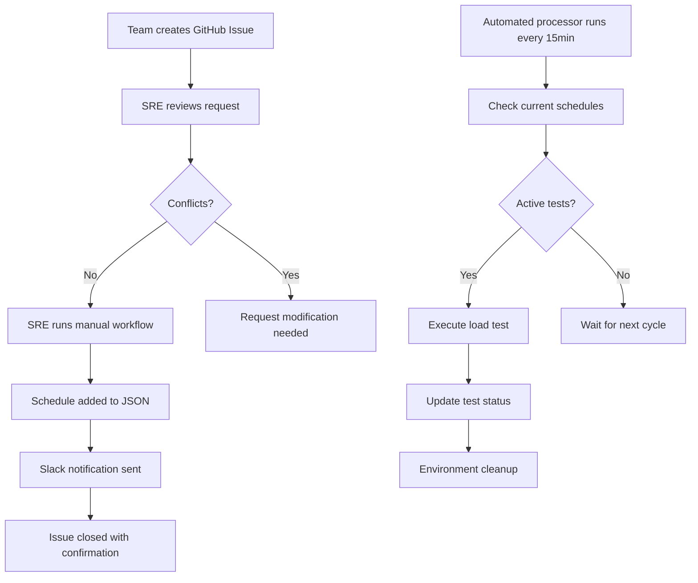

# Load Testing Scheduler

A GitHub-based system for managing shared preprod load testing environments across multiple feature teams.

## Features

- **Schedule-based time slot management** with conflict detection
- **GitHub Issues integration** for time slot requests
- **Automated workflows** for scheduling and processing tests
- **Team access control** via CODEOWNERS and GitHub teams
- **Slack notifications** for scheduling updates
- **30-minute buffer time** between tests for environment cleanup
- **Priority-based scheduling** (P0/P1/P2) for emergency tests

## Quick Start

### 1. Request a Load Test Time Slot

Create a new issue using the "Load Test Time Slot Request" template:

1. Go to **Issues** → **New Issue**
2. Select **Load Test Time Slot Request**
3. Fill in all required fields:
   - Team name
   - Requested date/time (UTC)
   - Duration (30min - 4 hours)
   - Test type (load/stress/spike/volume)
   - Contact person and Slack channel

### 2. SRE Team Reviews and Schedules

Once your issue is submitted:
1. SRE team reviews for conflicts and resource availability
2. If approved, they'll run the manual scheduling workflow
3. You'll get a Slack notification confirming the booking
4. The issue will be automatically closed with confirmation details

### 3. Automated Test Execution

- Tests are automatically processed every 15 minutes during business hours
- You'll receive Slack notifications when your test starts
- Environment cleanup happens automatically with 30-minute buffers

## Team Onboarding

### Prerequisites

- Your team must be defined in the workflow configuration
- You need appropriate GitHub team membership
- Slack webhook must be configured for your team channel

### SLA

- **Booking lead time**: 48 hours minimum
- **Maximum duration**: 4 hours per test slot
- **Weekly limit**: 8 hours per team (adjustable)
- **Buffer time**: 30 minutes between tests
- **Business hours**: 9 AM - 6 PM UTC, Monday-Friday

## Usage Examples

### Manual Scheduling (SRE Team)

```bash
# Add a load test for team-alpha
ruby lib/schedule_updater.rb \
  --datetime "2025-01-20T14:00:00Z" \
  --team "team-alpha" \
  --duration 120 \
  --test-type "load" \
  --contact "@alice" \
  --slack-channel "#team-alpha" \
  --app-version "v2.1.0" \
  --expected-load "1000 concurrent users" \
  --priority "P1"
```

### Processing Schedules

```bash
# Process current schedules (runs automatically via cron)
ruby lib/schedule_processor.rb
```

## Configuration

### Teams Configuration

Edit the workflow files to add your teams:

```yaml
# In .github/workflows/manual-schedule-update.yml
team_name:
  type: choice
  options:
    - 'your-team-name'
    - 'another-team'
```

### Slack Integration

Set up these GitHub secrets:
- `SLACK_WEBHOOK_PREPROD` - For scheduling notifications
- `SLACK_WEBHOOK_ALERTS` - For error notifications

### Team Access Control

Update `.github/CODEOWNERS` to define team permissions:

```
docs/your-team/ @your-org/your-team-leads
```

## Workflow Overview



## Architecture

- **Storage**: JSON file (`config/schedules.json`) with schedule data
- **Processing**: Ruby scripts for validation and execution
- **Automation**: GitHub Actions for scheduling and processing
- **Notifications**: Slack webhooks for team communication
- **Access Control**: GitHub teams and CODEOWNERS

## Contributing

1. All changes to core logic require SRE team approval
2. Use the existing Ruby style (RuboCop configured)
3. Add tests for new functionality
4. Update documentation for user-facing changes

## Troubleshooting

### Common Issues

**"Time slot conflicts with existing tests"**
- Check the current schedule in `config/schedules.json`
- Remember the 30-minute buffer requirement
- Try a different time slot

**"Team authorization failed"**
- Ensure you're a member of the correct GitHub team
- Contact SRE team to verify team configuration

**"Workflow dispatch failed"**
- Check you have the correct permissions
- Verify all required fields are filled
- Check GitHub Actions logs for detailed errors

### Getting Help

- **Documentation**: Check the `docs/` folder for detailed guides
- **Emergency support**: Use the Slack emergency channel link in issue templates
- **Bug reports**: Create a GitHub issue with the "bug" label

## License

MIT License - see LICENSE file for details.